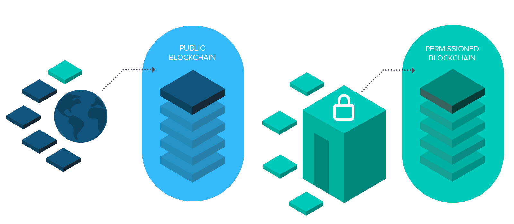

############
What is AEN?
############

**********************
The Smart Asset System
**********************

|AEN| is a blockchain platform built from the ground up to be simple for developers to use blockchain technology.

AEN is built around a powerful system to customize your using of the blockchain. We call it the *Smart Asset System*. It gives you the power to use AEN as if it were a custom blockchain built for your application and your assets.

.. figure:: ../resources/images/smart-assets-system.png
    :align: center
    :width: 600px

    The Smart Asset System

Rather than force you to write your own “smart contract” code from scratch or use off-blockchain methods that define custom assets for you application, AEN gives you direct access to a specialized set of tested and secure on-blockchain features.

AEN is suitable for an amazing variety of solutions of different classes, such as direct public transactions via a streamlined smartphone app, efficient cloud services that connect client or web applications, or a high-performance permissioned enterprise back-end for business-critical record keeping.

*******************
Architecting on AEN
*******************

AEN :doc:`nodes <../concepts/node>` provide a powerful, stable and secure platform where smart asset transactions are conducted, searched, and immutably logged to the blockchain ledger.

All the functionalities are available through the API interface on each node in the network itself. This means that the blockchain can be used to create a variety of architecture solutions with lightweight code in any language.

Some examples of possible architecture solutions:

.. figure:: ../resources/images/arquitecturing-AEN-solutions.png
    :align: center
    :width: 600px

**Mobile app direct access**

A lightweight app directly interfaces to blockchain features.

**Client/server model**

A gateway server manages blockchain usage for a client app or web service.

**Legacy system integration**

A gateway server links existing business contract logic, systems, or databases to the blockchain ledger.

.. |AEN| raw:: html

    <a href="https://AEN.io/" target="_blank">AEN</a>

******************
Public and Private
******************

AEN provides both a decentralized, open and self-sustaining **public blockchain** that can be used by anyone – as well as a **permissioned/private blockchain solution** that can be provisioned specifically for your use on your servers when speed and privacy are the priority.

Continue: :doc:`Setting up your workstation <setup-workstation>`.
